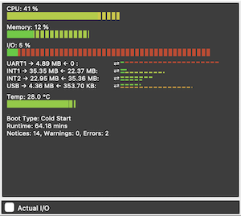

# PyGPSClient Release Notes

### RELEASE v1.3.26

ENHANCEMENTS:

1. Add System Monitor widget which displays device system status in bar chart format (cpu, memory and I/O utilisation, temperature, boot state, etc.), for those u-blox devices that support MON-SYS and MON-COMMS message types. To access, select Menu..View..Show System Monitor.



1. Add IPv6 support to NTRIP configuration panel (requires pygnssutils >= 1.0.8).
1. Add double-click actions to widgets;

   - double-click graph widget to toggle legend
   - double-click spectrum widget to toggle legend and L-Band markers
   - double-click map widget to refresh web map immediately
   - double-click scatterplot widget to reset plot

CHANGES:

1. Update min pygnssutils version to 1.0.9

### RELEASE v1.3.25

ENHANCEMENTS:

1. UBX Configuration Load/Save/Record facility will now accept u-center *.txt configuration files (**for Generation 9+ devices only**) as well as binary *.ubx files. Thanks for @wdwalker in #66 for suggestion. Compatible configuration files for ZED-F9P devices can be found, for example, on the [ArduSimple web site](https://www.ardusimple.com/configuration-files/). FYI: Generation 9+ u-center *.txt configuration files contain hexadecimal representations of MON-VER and CFG_VALGET UBX messages, e.g.:
    ```
    MON-VER - 0A 04 DC 00 45 ...
    CFG-VALGET - 06 8B 44 01 ...
    CFG-VALGET - 06 8B 44 01 ...
    ```
    The CFG-VALGET messages are converted into CFG-VALSET commands for uploading to the receiver. 
1. New module `widgets.py` containing a configuration data dictionary for all user-selectable widgets. Intention is to make it easier to add and configure new widgets.

FIXES:

1. Fix error when updating NTRIP Client dialog status (e.g. with 'unauthorized' errors)

CHANGES:

1. Bandit security analysis added to VS Code and GHA workflows.
1. Update min pygnssutils version to 1.0.7
1. Internal updates to VSCode and GHA workflows.

### RELEASE v1.3.24

FIXES:

1. Fixes #63 ValueError if pygpsclient started with no default config file

### RELEASE v1.3.23

CHANGES:

1. Improved legibility in 'Light' and 'Dark' O/S modes by removing hard-coded Entry widget background colors. Fixes [#60](https://github.com/semuconsulting/PyGPSClient/issues/60). (*NB: the PyGPSClient application itself retains its 'dark' main widget GUI styling and there are no current plans to introduce user-selectable color themes.*)
1. Minimum pygnssutils version updated to 1.0.6.
1. Minor fixes to configuration load status messages.


### RELEASE v1.3.22

ENHANCEMENTS:

1. Add facility to save and reload PyGPSClient application configuration file in json format. Covers:
    * frm_settings dialog values (protocols, console format, degrees format, units, etc.)
    * widget configuration (which widgets are visible or hidden)
    * user-defined GNSS and SPARTN serial ports
    * API keys
    * console color tagging values
    * user-defined UBX command presets
1. Will look for default config file `$HOME/pygpsclient.json` on startup - a sample file is provided.
1. Add ability to specify a custom config file via command line argument `-C`, `--config`.
1. Application config file obviates need for discrete `colortags` and `mqapikey` files. These will be deprecated in a subsequent version.
1. Enhance spectrum view with optional additional GNSS frequency band markers.
1. Minor improvements to spectrum widget to show GLONASS & Galileo frequency band markers in addition to GPS.
1. Minor improvements to automated widget positioning and resizing.

### RELEASE v1.3.21

ENHANCEMENTS:

1. Various minor tweaks to improve widget legibility, contrast and positioning at various scales.
1. Correctly cater for up to 3 rows of optional widgets.
1. Add color helper functions rgb2str, str2rgb, col2contrast.
1. Address minor pylint advisories.
1. Added 'Update Toolchain' task to VS Code workflow.


### RELEASE v1.3.20

ENHANCEMENTS:

1. New Scatter Plot widget added, showing variability in position reporting over a period of time. Access via View..Show/Hide Scatter Plot. Thanks to @nmichaels-qualinx for contribution.

CHANGES:

1. Project migrated to pyproject.toml build mechanism and standard project structure (/src). The setuptools build backend has been retained.
2. Internal build and test workflow streamlined.

### RELEASE v1.3.19

FIXES:

1. Fix glitch which caused banner hAcc/vAcc values to be garbled if using imperial units.

ENHANCEMENTS:

1. Facility to store L-Band correction receiver (D9S) configuration to persistent storage (BBR, Flash, EEPROM) added to SPARTN Configuration Panel.

### RELEASE v1.3.18

FIXES:

1. Fix to GNSS SPARTN key config upload. Fixes [#44](https://github.com/semuconsulting/PyGPSClient/issues/44)

ENHANCEMENTS TO SPARTN CLIENT:

1. SPARTN dialog no longer needs to be kept open while IP or L-Band client is running.
1. Use `pygnssutils.GNSSMQTTClient` class in `pygnssutils>=1.0.4` rather than embedded `MQTTHandler` class. MQTT client also now available as a command line utility `gnssmqttclient` - see https://github.com/semuconsulting/pygnssutils#gnssmqttclient for details.
1. Enhance and streamline SPARTN client functionality.
1. Minor improvements to SPARTN client error handling.
1. Add ability to load SPARTN config from JSON file.

OTHER ENHANCEMENTS:

1. Auto-enable MON-SPAN message if Spectrum View widget is opened.
1. Various comment and docstring improvements.


### RELEASE v1.3.17

FIXES:

1. Cater for updates in pynmeagps to fix typo in UBX00 message - PUBX00 message provideds TDOP rather than PDOP. 

### RELEASE v1.3.16

ENHANCEMENTS:

1. Add SPARTN Configuration utility, accessed via Menu..Options..SPARTN Configuration Dialog and button in Settings panel, offering:
    - IP (MQTT) SPARTN correction source configuration.
    - L-Band (D9*) SPARTN correction receiver configuration.
    - GNSS Receiver (F9*) configuration.
2. Supports both IP and L-Band SPARTN RTK correction sources to achieve centimetre-level accuracy.
3. NB: reception and decryption of SPARTN correction data may require a paid subscription to a SPARTN location service e.g. u-blox PointPerfect. Check terms and conditions before subscribing (*this project has no affiliation whatsoever to such services*).

See README for details.

### RELEASE v1.3.15

ENHANCEMENTS:

1. New GPX Track Viewer facility added, accessed via Menu..Options..GPX Track Viewer. Displays track on dynamic web page alongside elevation and speed profiles (where available) and key metadata. Dialog is fully resizeable. Click folder icon to load a GPX file. Click redraw icon to redraw track and profile at any time.

### RELEASE v1.3.14

ENHANCEMENTS:

1. New `CFG Configuration Load/Save/Record` facility added to UBX Configuration panel. This allows users to 'record' any configuration commands (UBX CFG messages) sent to a device to an internal memory array, and subsequently save this array in a binary file. Saved files can be reloaded and the messages replayed to any compatible device. This provides a means to easily reproduce a given sequence of configuration commands, or copy a saved configuration between compatible devices.
2. Msg Mode listbox added to serial configuration dialog. Defaults to 'GET' (periodic or poll response message types) but can be set to 'SET' or 'POLL' to read serial or file streams containing command or poll message types. 
3. Internal code streamlining for widget selection and arrangement. New reset layout option added.

### RELEASE v1.3.13

ENHANCEMENTS:

1. New spectrum analysis widget added. Displays spectrum data from MON-SPAN messages. To turn widget on or off, select Menu...View..Show/Hide Spectrum.

FIXES:

1. Fix attribute typo which affected processing of HNR-PVT message types.

### RELEASE v1.3.12

CHANGES:

1. Minimum pygnssutils version updated to v1.0.0.
2. shields.io build status badge URL updated.
3. Image links in README.md updated to absolute links (so images show on PyPi).

No other functional changes.

### RELEASE v1.3.11

ENHANCEMENTS:

1. Python 3.11 support added to setup.py. No other functional changes.

### RELEASE v1.3.10

ENHANCEMENTS:

1. Add provision to pass user-defined serial port designator via command line keyword argument port or environment variable PYGPSCLIENT_USERPORT.

e.g.

```shell
pygpsclient port=/dev/tty12345
```
or
```shell
export PYGPSCLIENT_USERPORT="/dev/tty12345"
pygpsclient
```

Any user-defined port will appear in the serial port listbox as the first preselected item.

### RELEASE v1.3.9

ENHANCEMENTS:

1. GGA position source radio button added to NTRIP Client dialog - allows user to select from live receiver or fixed reference (previously PyGPSClient would automatically use receiver position if connected or fixed reference if not).

### RELEASE v1.3.8

ENHANCEMENTS:

1. New CFG-* Other Configuration command panel added to UBX Configuration panel. Provides structured inputs for a range of legacy CFG commands. **NB:** For Generation 9+ devices, legacy CFG commands are deprecated in favour of the CFG-VALGET/SET/DEL Configuration Interface commands in the adjacent panel.
2. When a legacy CFG command is selected from the CFG-* listbox, a POLL request is sent to the device to retrieve the current settings; these are then used to populate a series of dynamically generated Entry widgets. The user can amend the values as required and send the updated set of values as a SET message to the device. After sending, the current values will be polled again to confirm the update has taken place. **NB:** this mechanism is dependent on receiving timely POLL responses. Note caveats in README re. optimising POLL response performance.
3. For the time being, there are a few constraints with regard to updating certain CFG types, but these will hopefully be addressed in a future update as and when time permits. The `pyubx2` library which underpins`PyGPSClient` fully supports *ALL* CFG-* commands.
4. The new panel can be enabled or disabled using the `ENABLE_CFG_OTHER` boolean in `globals.py`.

### RELEASE v1.3.7

ENHANCEMENTS:

1. "Parsed + Tabular Hex" option added to data logger.
2. "Check for Updates" function enhanced in About dialog box - works better on Linux.
3. Min 'pygnssutils' version updated to 0.3.1 - fixes issues with some NTRIP 2 caster handling.

### RELEASE v1.3.6

CHANGES:

1. Internal refactoring to use common pygnssutils utility classes, resulting in signficant de-duplication of code. No functional changes.

### RELEASE v1.3.5

ENHANCEMENTS:

1. **New BETA Socket / NTRIP Server feature**. Capable of operating in two modes - either (a) as an open, unauthenticated TCP socket server, or (b) as an authenticated NTRIP server.
3. In open socket server mode, the output socket stream can be accessed by any TCP socket client capable of parsing raw GNSS data, including another instance of PyGPSClient or `gnssdump` (the CLI utility installed with `pyubx2`) running on another machine (*assuming the traffic is permitted through any firewalls*).
4. In NTRIP server mode, the socket stream can be accessed by any authenticated NTRIP client. The sourcetable contains a single entry corresponding to the PyGPSClient host. The server authentication credentials are set via two environment variables `PYGPSCLIENT_USER` and `PYGPSCLIENT_PASSWORD`.
5. In either mode, the maximum number of clients is arbitrarily limited to 5. A label on the settings panel indicates the number of connected clients - this turns red when the maximum has been reached.
6. The socket host address is `0.0.0.0` (i.e. binds to all available IP addresses on the host machine). The socket port defaults to `50010` but is configurable via the settings panel (`2101` is the convention for NTRIP servers but is not mandated). 
7. The default configuration for the socket server is set in `globals.py` as `SOCKSERVER_HOST`, `SOCKSERVER_PORT` and `SOCKSERVER_MAX_CLIENTS`.

### RELEASE v1.3.4

ENHANCEMENTS:

1. Enhancement to NTRIP client - will now automatically identity and select the closest mountpoint in the sourcetable (among those mountpoints which provide location information, and assuming current location is known approximately). Selection can be overridden.
2. hacc/vacc display on banner increased to 3dp (limit of reliability). **NB:** in order to see hacc/vacc readings, you will need to be receiving messages which provide this data e.g. NMEA PUBX-00 or UBX NAV-PVT, NAV-POSLLH. It *cannot* be reliably inferred from hdop/vdop.
3. Minor internal refactoring to improve performance and resilience of NTRIP client.

### RELEASE v1.3.3

FIXES:

1. Fix old reference to `enqueue()` method in serial handler.

### RELEASE v1.3.2

CHANGES:

1. Internal refactoring of `serial_handler.py` and `socket_handler.py` into single `stream_handler.py`.
2. Minimum versions of `pyubx2` and `pynmeagps` updated to 1.2.9 and 1.0.11 respectively.

FIXES:

1. Preset message rate commands now set rates on ALL ports including UART2 (UART2 was previously omitted).

### RELEASE v1.3.1

ENHANCEMENTS:

1. Console color tagging is now user-configurable. The fixed color tags that were in `globals.py` are instead loaded from a file named 'colortags' in the user's home directory (see example in project root directory). A special color tag of 'HALT' allows the user to terminate streaming when a specified string match is found - this could for example be a particular message identity or a particular attribute value.
2. Add optional manual GGA settings (lat, lon, alt. sep) to NTRIP configuration dialog. If GGA sentence transmission is enabled, GGA sentence can either be constructed from live GNSS readings (if a receiver is connected) or from the four manual settings. If a GNSS receiver is not connected, the manual GGA settings must be used to send a GGA sentence.
3. Internal refactoring to use consistent message queuing technique for all incoming data streams (eliminates code duplication & offers moderate performance improvement). 

FIXES:

1. Enhanced error handling in serial and socket handlers - Fixes #22

### RELEASE v1.3.0

ENHANCEMENTS:

1. New BETA feature supports reading from TCP or UDP socket in addition to USB/UART and Binary File stream. At present, only open (i.e. unauthenticated, unencrypted) sockets are supported, and the connection is input only (i.e. you can't send UBX config polls or updates via the socket), but this may be enhanced in future versions.
2. Datalogging enhanced to record incoming NTRIP data stream.
3. Minor enhancements to NTRIP client exception handling.

### RELEASE v.1.2.1

CHANGES:

1. Minimum versions of `pyubx2` and `pyrtcm` updated to 1.2.7 and 0.2.5 respectively.

### RELEASE v.1.2.0

ENHANCEMENTS:

1. Various performance enhancements via internal refactoring, including updating the GUI widgets on a minimum interval basis (rather than on receipt of each NMEA or UBX message), streamlining and centralising GNSS status updates, and eliminating redundant tkinter `update()` and `update_idletasks()` operations. Note, however, that some [tkinter performance issues](https://github.com/semuconsulting/PyGPSClient#knownissues) remain on MacOS Monterey.
2. DGPS status added to information banner. **NB** this indicates the successful reception of DGPS correction data (e.g. RTCM3 or SBAS) based on information from NMEA (GGA, GNS) or UBX (NAV-PVT, NAV-STATUS, RXM-RTCM) messages. It does *not* necessarily indicate that a DGPS correction has been applied. Note that a) NMEA and UBX messages do not always give consistent indications of DGPS receipt status, and b) DGPS status *cannot* be reliably inferred from other NMEA message types (e.g. RMC, VTG) earlier than NMEA 4.10. 
3. UBX Configuration dialog can now be opened regardless of whether a device is connected (*but commands will only take effect when connected!*). The dialog is also now resizeable. (*These enhancements afford a workaround for current MacOS Monterey performance issues.*)
4. GPX Track recording now enabled for all NMEA and UBX message types which contain relevant position data, and trackpoints now include dgps data where available.


### RELEASE v1.1.9

ENHANCEMENTS:

1. Add Beta NTRIP Client facility. Connects to specified NTRIP server (caster) and feeds received RTCM3 messages through to connected RTCM3-compatible GNSS receiver. Tested with a variety of public and private NTRIP casters and u-blox GNSS receivers but additional testing and feedback welcome.

### RELEASE v1.1.8

ENHANCEMENTS:

1. Min version of `pyrtcm` updated to 0.2.4 (fixes a few RTCM parsing issues).
2. `pyrtcm` version added to About dialog.

### RELEASE v1.1.7

ENHANCEMENTS:

1. Added provision for RTCM3 message decoding via `pyrtcm` library. **NB** `pyrtcm` is still in Alpha
and provides basic decoding of RTCM3 messages to their constituent data fields. To revert to the 
'stub' RTCM3 decoding as used in v1.1.6, set the `USE_PYRTCM` constant in `globals.py` to `False`.
2. Min `pyubx2` version updated to v1.2.6.
3. Banner will now display high precision lat/lon where available.

### RELEASE v1.1.6

ENHANCEMENTS:

1. Added provision for RTCM3 messages following enhancements in `pyubx2` v1.2.5. **NB** `pygpsclient`
does not currently decode RTCM3 data - it simply indicates the presence of an RTCM3 message (with message
type) in the input stream.
2. Min `pyubx2` version updated to v1.2.5.

### RELEASE v1.1.5

FIXES:

1. Fix issue #9 where app becomes unresponsive with a null data stream. 

### RELEASE v1.1.4

ENHANCEMENTS:

1. Added tabular hex format to console display and datalogging format options.
2. Internal refactoring of serial handler to use `pyubx2.UBXReader.read()` function. 
3. Min pynmeagps version updated to 1.0.7
4. Min pyubx2 version updated to 1.2.4
5. Python 3.6 dropped from list of supported versions (if should still run fine, but 3.6 is now end of life)
6. Python 3.10 added to list of supported versions *BUT* note there still appear to be some teething performance issues with the version of tkinter embedded in Python 3.10 on MacOS Monterey. See installation notes for futher details.

FIXES:

1. Fix issue where first few seconds of datalogging or gpx tracking would fail on serial connections

### RELEASE v1.1.3

ENHANCEMENTS:

1. Additional configdb key categories added to CFG-VALGET/SET/DEL panel (CFG-HW-RF*, CFG-SPARTN*).
2. Minimum pyubx2 version updated to >=1.2.3.
3. Version checker added to Help panel.

### RELEASE v1.1.2

ENHANCEMENTS:

1. UBX handler scaling factors removed as pyubx2 >=1.2.0 now applies these internally.
2. Minimum pyubx2 version updated to >=1.2.0.


### RELEASE v1.1.1

ENHANCEMENTS:

1. Minor enhancements to UBX config configuration database dialog to aid category selection.
2. Minimum pyubx2 and pynmeagps versions updated to 1.1.6 and 1.0.6 respectively.

### RELEASE v1.1.0

ENHANCEMENTS:

1. Updated to handle changes in pyubx2 v1.1.0 - parsing of individvual bits in bitfield (type 'X') message attributes. For example, the NAV-PVT attribute valid (X1) is now parsed as four individual bit flags: validDate (U1), validTime (U1), fullyResolved (U1) and validMag (U1).

### RELEASE v1.0.11

FIXES:

1. Fix hidden confirmation box issue on UBX config dialog.
2. Various other minor fixes to dialog handling and positioning

### RELEASE v1.0.10

ENHANCEMENTS:

1. Console and datalogging enhanced to display either parsed, binary or hexadecimal formats.
2. Minimum pyubx2 version updated to 1.0.16.
3. Minimum pynmeagps version updated to 1.0.4.

### RELEASE v1.0.9

ENHANCEMENTS:

1. Additional CFG-VAL categories added for NEO-D9S, ZED-F9K, ZED-F9P & ZED-F9R Receivers.
2. Minimum pyubx2 version updated to 1.0.14.

### RELEASE v1.0.8

FIXES:

1. Updated to use pynmeagps v 1.0.3.

### RELEASE v1.0.7

FIXES:

1. Fixed distribution packaging glitch in 1.0.6 - CFG-BDS category should now appear in UBX CFG-VALSET dialog.


### RELEASE v1.0.6

CHANGES:

1. Entry point added to setup.py to allow app installed via pip to be invoked via simple command `pygpsclient`.
2. Minimum pynmeagps version updated to v1.0.1.
3. SUpport for BDS messages added to UBX CFG-VALSET config dialog.
4. Minor build script and documentation updates.


### RELEASE v1.0.5

CHANGES:

1. Helper methods moved from globals.py to new module helpers.py
2. Minimum pynmeagps version updated to v1.0.0

### RELEASE v1.0.4

FIXES:

1. Display position fix from HNR-PVT message.
2. Fix error on cancelling/quitting input filepath dialog on Linux.


### RELEASE v1.0.3

FIXES:

1. Fix 'flashing map' issue with mixed NMEA / UBX streams and no satellite fix. NB: 'flashing' (alternating between map and 'no fix' warning) may still occur if you have mixed streams and one outputs a valid position while the other doesn't, which can happen (e.g. position solutions are often reported in UBX messages slightly before they appear in NMEA messages).
2. Fix error on cancelling/quitting filepath dialog on Linux.
3. Fix highlighting of pre-selected serial port.
4. Other minor UI fixes.

ENHANCEMENTS:

1. Add facility to write data log in raw, parsed or both formats.
2. Add ability to refresh list of connected serial devices at run time. An existing connection must be terminated before connecting to a different device.
3. Allow datalogging from file input as well as serial port input.

INTERNAL CHANGES:

1. Generic serial port dialog moved to pygpsclient package; common package removed.

### RELEASE v1.0.2

FIX:

1. Fix failure to update vacc and hacc in banner from NMEA PUBX00 message

### RELEASE v1.0.1

ENHANCEMENTS:

1. NMEA handler updated to use new pynmeagps library (>=0.1.7) rather than pynmea2. This lightweight library obviates the need to perform NMEA lat/lon and other format conversions and makes the parsed NMEA representation more consistent with UBX.

### RELEASE v1.0.0

Version and status updated to v1.0.0 Production/Stable

ENHANCEMENTS:

1. Timeout setting added to common Serial port control dialog. 
2. Serial port baudrate configuration settings range extended to 921600.

